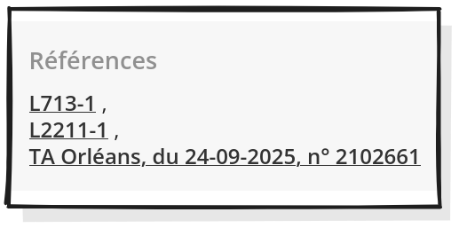

<!--
author:   Samuel Jamet

email:    samuel.jamet.bib@proton.me

version:  0.0.1

language: fr

narrator: US English Female

comment:  Try to write a short comment about
          your course, multiline is also okay.

link:     https://cdn.jsdelivr.net/chartist.js/latest/chartist.min.css

script:   https://cdn.jsdelivr.net/chartist.js/latest/chartist.min.js

translation: Deutsch  translations/German.md

translation: Français translations/French.md
-->

# LeDoctrinal

        --{{0}}--
LeDoctrinal est une base incontournable en droit, mais il faut bien comprendre son périmètre. Elle couvre le droit public, privé et mixte, ainsi que les juridictions européennes et françaises.
Son point fort : la Doctrine (références bibliographiques avec liens vers les éditeurs) et la Jurisprudence (en texte intégral). Attention en revanche, la partie Norme (législation) y est présente mais souvent capricieuse.

Couverture et périmètre de la base
---


`````````````````````````````````````````````````````
                                                        +-----------------------------------+
                                                   +--->|Doctrine (données bibliographiques)|
                                                   |    +-----------------------------------+
                                                   |
                             +----------------+    |    +---------------------------------+
                     +---->> |Sources du droit|----+--->|Jurisprudence (en texte intégral)|
                     |       +----------------+    |    +---------------------------------+
                     |                             |
                     |                             |    +------------------------------------+
                     |                             +--->|Norme (en texte intégral en théorie)|
                     |                                  +------------------------------------+
                     |
 .-------------.     |       +-----------------+    +--------------------------------+
(  LeDoctrinal  )----+---->> |Branches du droit|--->|Toutes les branches représentées|
 `-------------´     |       +-----------------+    +--------------------------------+
                     |
                     |                              +----------+
                     |                        +---->|Européenne|
                     |       +------------+   |     +----------+       +-----------------+
                     +---->> |Juridictions|---+                   +--->|Constitutionnelle|
                             +------------+   |                   |    +-----------------+
                                              |                   |
                                              |     +---------+   |    +----------+
                                              +---->|Française|---+--->|Judiciaire|
                                                    +---------+   |    +----------+
                                                                  |
                                                                  |    +---------------+
                                                                  +--->|Admninistrative|
                                                                       +---------------+
`````````````````````````````````````````````````````
## La recherche simple et thématique

        --{{0}}--
Pour commencer une recherche thématique, la règle d'or est la simplicité : associez deux mots-clés, trois maximum. Par exemple : « droit à l’oubli » et « intelligence artificielle ». Les options de recherche se cumulent : la base cherchera ces termes à la fois dans les titres et dans les mots-clés des documents. 

Privilégier la simplicité de la requête : associer deux mots-clés maximum.


Les options de recherche se cumulent : ici je recherche les références qui contiennent « droit à l’oubli » et « intelligence artificielle » à la fois dans leur titre et dans leurs mots-clés.

### La recherche par référence

        --{{0}}--
Une fonctionnalité très puissante : vous pouvez chercher de la documentation à partir de ce qu'elle cite. Par exemple, si vous étudiez une décision du Tribunal Administratif d’Orléans, vous pouvez faire remonter toute la doctrine qui la commente. N'oubliez pas d'utiliser les abréviations officielles des juridictions. 

Il est possible de rechercher des ressources à partir de ce à quoi elles font références (jurisprudence et législation)


Par exemple, je cherche ici à faire remonter toutes la doctrine qui cite une décision du Tribunal Administratif d’Orléans.



### La recherche par auteur

        --{{0}}--
Si vous cherchez les publications d'un auteur précis, attention à un piège classique de l'interface : ne mettez jamais le prénom et le nom entre guillemets, sinon la recherche échouera. 


## La recherche experte

Pour votre niveau de recherche, l'option « Recherche experte » sera votre meilleur alliée. Elle permet de créer des équations précises avec les opérateurs booléens ET / OU. Il permet aussi de créer des groupements thématiques (ex: « protection de la vie privée » ET « droit communautaire »).
Surtout, c'est le seul endroit où vous pouvez exclure un terme de vos résultats, et chercher une expression exacte en utilisant les guillemets.


## La page des résultats

Selon que vous regardez la doctrine, la jurisprudence ou la norme, les filtres s'adaptent. En doctrine, vous pouvez filtrer par revue ou par date. En jurisprudence, vous pouvez filtrer par juridiction (française, européenne) ou par nombre de commentaires. En norme, vous filtrerez par type de texte (Loi, décret...). 

## Le chaînage de références

C'est la grande force de LeDoctrinal : le chaînage. La notice bibliographique est un vrai carrefour. Depuis une notice, vous pouvez rebondir vers d'autres articles du même auteur, le texte officiel cité, ou le numéro entier de la revue. À l'inverse, à partir d'une décision de justice, un clic vous donne toute la doctrine qui la cite ou la commente. 

## Les alertes

En thèse, la veille est cruciale. LeDoctrinal permet de poser des alertes de deux manières : soit sur une décision précise (en cliquant sur la cloche au-dessus de son titre) pour savoir si elle est commentée ou frappée d'appel ; soit sur une équation de recherche entière depuis la page de résultats. 

## Cas d'usage

La thématique : La responsabilité de l'État pour violations systémiques des droits de l'Homme (en droit français).
L’objectif de cet exercice : rassembler des références doctrinales et jurisprudentielles en droit français. 

### Une recherche simple

Faites la recherche :
« responsabilité de l’Etat » « violations systémiques » « droits de l’homme »
Que constatez-vous ? 

(1) « Il est important de bien distinguer ce qui relève de votre sociolecte, de ce qui relève du vocabulaire d’une base de donnée. Les deux ne correspondant pas forcément.
Une telle recherche ne remonte que peu voire pas de résultats, il faut donc modifier sa stratégie.
En cas de recherche infructueuse, il est important de pouvoir changer d’angle et/ou d’élargir le scope avec l’utilisation d’un terme plus général. »

(2) « Je vous propose de choisir un autre angle : plutôt que de partir des violations de droits, on peut s’intéresser aux obligations des Etats en matière de droits humains.

### Une recherche "experte"

(3) On peut donc lancer une nouvelle requête :
« obligations positives » « droits de l’homme »
Avec cette requête, on est en droit d’espérer que la question des violation des droits PAR des États sera traitée dans nos références ».

(4) Lancez la requête depuis la recherche experte. 

### Exploitation des résultats

On a donc 172 résultats en doctrine, on pourrait éventuellement tous les viser, mais on peut s’épargner un peu de travail inutile parce que nous avons d’autres critères de sélections à appliquer sur ce qui nous est remonter.
Comment ne conserver que les résultats qui concernent le droit français et pas le droit européen qui est très présent ? 

### Restriction jurisprudence

Toujours sur ce même sujet, on veut maintenant restreindre le scope aux décisions du Conseil d’État. 
Expliquez comment vous vous y prendriez.

On continue de restreindre notre recherche. Sur les 5 décisions, l’une d’elle, mentionnée au Lebon concerne une atteinte à la liberté fondamentale, donnez son n° de pourvoi. 

### Chaînage des références

A partir de la décision que l’on est en train de consulter, trouvez dans quelle(s) revue(s) ont été publiés des articles faisant référence à cette décision 

## More

Find out what you can even do more with quizzes:

https://liascript.github.io/course/?https://raw.githubusercontent.com/liaScript/docs/master/README.md